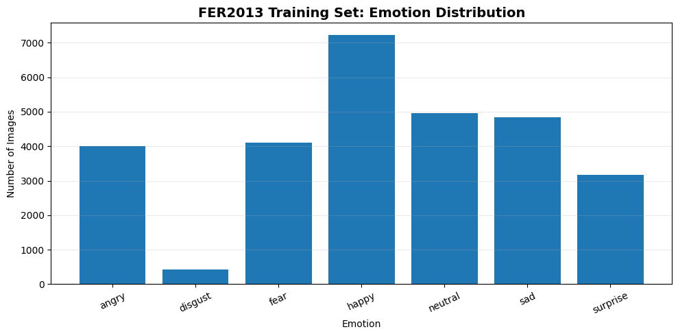
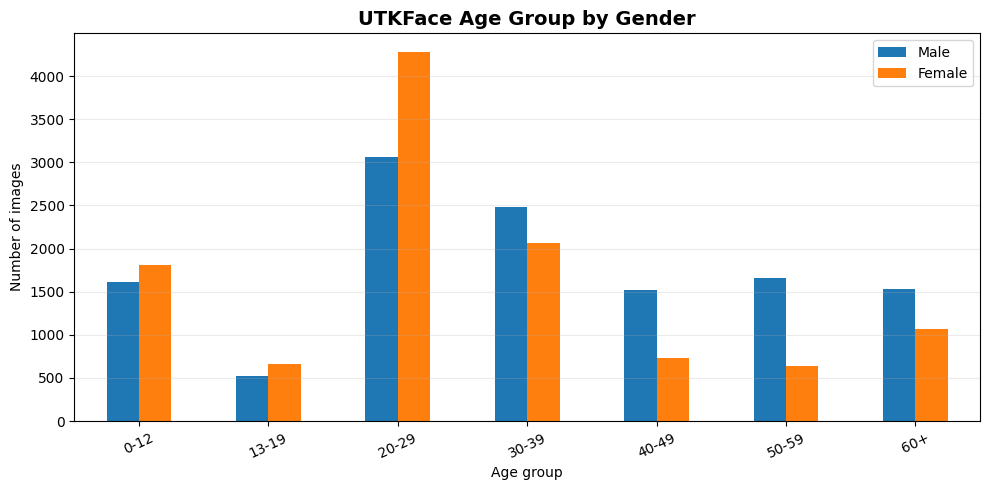
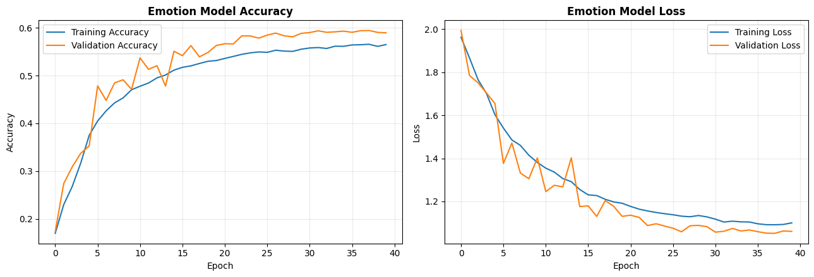
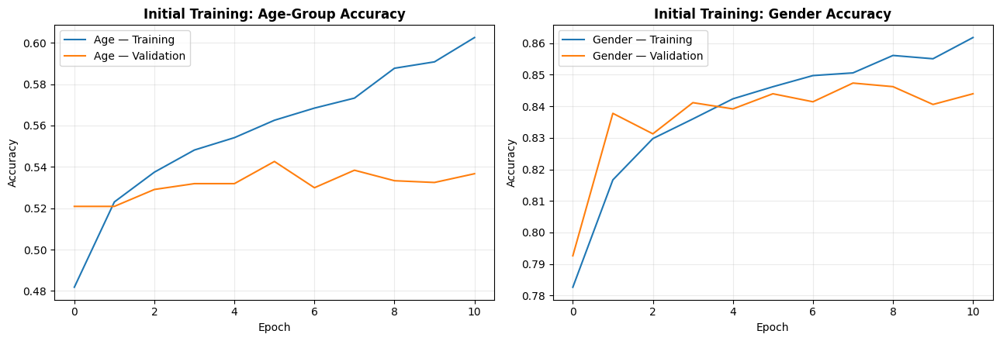
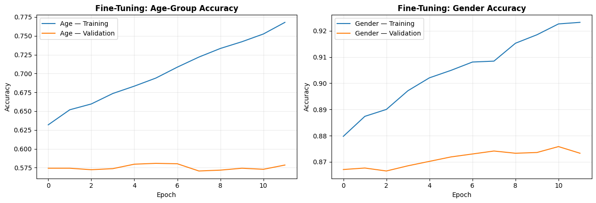
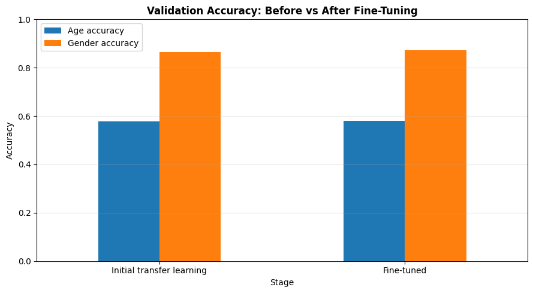
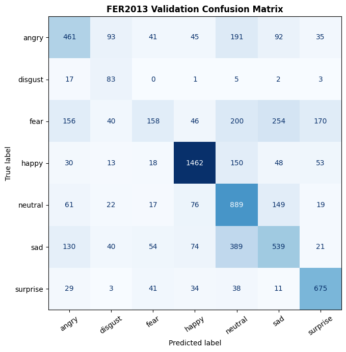
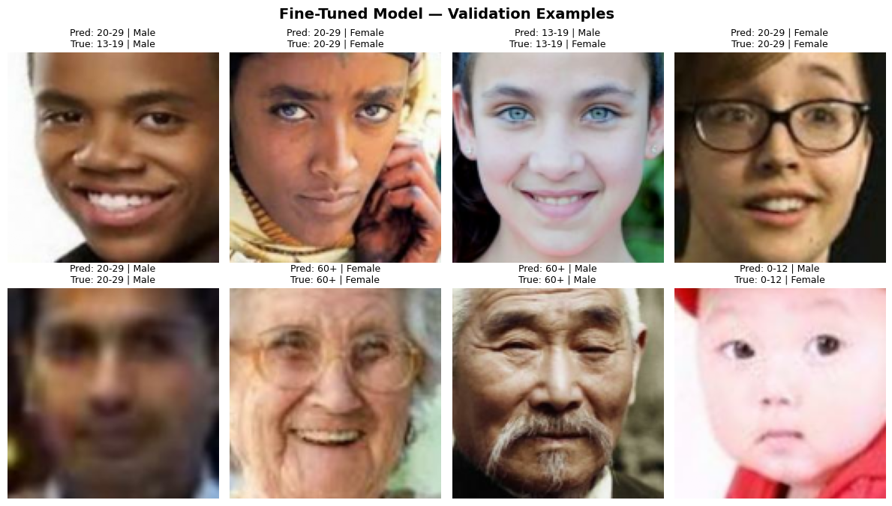

# Project Report

## Facial Emotion, Age Group, and Gender Prediction Using Deep Learning

### Project Partners

**Jahangir Amiri**
**Sadaf Aslam**

**Course:** Deep Learning
**Instructor:** Sir Sajid Majeed
**Program:** Post Graduate Diploma (PGD) in Data Science & AI
**Institution:** NED University of Engineering & Technology

---

## 1. Project Objective

The objective of this project is to develop a computer-vision system that detects a face from an image or webcam frame and produces three model-based predictions: facial emotion, age group, and gender. The project demonstrates the use of convolutional neural networks, transfer learning, multi-output modelling, and fine-tuning for facial-image analysis.

## 2. Datasets

### FER2013

FER2013 is used for seven-class facial emotion classification. The notebook first inspects the dataset and displays sample images before creating the training and validation generators.

### UTKFace

UTKFace is used for age and gender prediction. Age and gender labels are extracted from the image filenames, and the original ages are converted into seven broader age brackets for classification.

## 3. Methodology

### Emotion Model

A custom convolutional neural network is trained on 48×48 grayscale facial images. Batch normalization, pooling, dropout, data augmentation, class weighting, early stopping, model checkpointing, and learning-rate reduction are used to improve training stability and generalization.

### Age and Gender Model

MobileNetV2 pretrained on ImageNet is used as the feature extractor. The model has two outputs: a seven-class age-group classifier and a binary gender classifier. The pretrained base is initially frozen and is then partially unfrozen (last 30 layers) for fine-tuning with a smaller learning rate (1e-5).

### Face Detection

OpenCV's Haar Cascade frontal-face detector is used in the local webcam application before the detected face is cropped and passed to the trained models.

## 4. Exploratory Data Analysis

The notebook includes basic dataset inspection before model training. For FER2013, the class structure and representative images are checked. For UTKFace, sample images are displayed with labels derived from the filenames, and the distribution of the seven age groups is examined.

## 5. Evaluation

Results below are taken directly from the executed notebook (validation set).

### 5.1 Headline results

| Task | Dataset | Model | Validation accuracy | Validation loss |
|---|---|---|---|---|
| Emotion classification | FER2013 | Custom CNN | 0.594 | 1.051 |
| Age-group classification | UTKFace | MobileNetV2, frozen backbone | 0.577 | 1.109 |
| Gender classification | UTKFace | MobileNetV2, frozen backbone | 0.865 | 0.330 |
| Age-group classification | UTKFace | MobileNetV2, fine-tuned | 0.581 | 1.136 |
| Gender classification | UTKFace | MobileNetV2, fine-tuned | 0.872 | 0.331 |

### 5.2 Effect of fine-tuning

Unfreezing the last 30 layers of MobileNetV2 and continuing training at a lower learning rate produced a small improvement in accuracy for both heads (age: +0.4 points, gender: +0.7 points), but validation loss increased slightly on both. This suggests the fine-tuning stage gave the model modest additional discriminative power without a corresponding gain in calibration — likely because 15–20 epochs at a very low learning rate is enough to nudge decision boundaries but not enough to meaningfully re-shape the pretrained features. A longer fine-tuning run, or a slightly higher learning rate with stronger regularization, is a natural next experiment rather than assuming this configuration is close to optimal.

### 5.3 Emotion model — per-class breakdown

The 7-class FER2013 confusion matrix and classification report (from the notebook) show accuracy is not evenly distributed across emotions:

| Emotion | Precision | Recall | F1 | Support |
|---|---|---|---|---|
| Angry | 0.521 | 0.481 | 0.501 | 958 |
| Disgust | 0.282 | 0.748 | 0.410 | 111 |
| Fear | 0.480 | 0.154 | 0.234 | 1024 |
| Happy | 0.841 | 0.824 | 0.833 | 1774 |
| Neutral | 0.477 | 0.721 | 0.574 | 1233 |
| Sad | 0.492 | 0.432 | 0.460 | 1247 |
| Surprise | 0.692 | 0.812 | 0.747 | 831 |
| **Overall accuracy** | | | **0.594** | 7178 |

The model is strong on "happy" and "surprise," both visually distinctive expressions. It is weak on "fear" (recall 0.154 — roughly 5 out of 6 true "fear" examples misclassified, most likely as "sad" or "surprise") and unreliable on "disgust" (111 validation examples; precision/recall estimates are not stable at this sample size). This is consistent with known FER2013 characteristics: fear and disgust are underrepresented and visually ambiguous even for human annotators, a factor in why FER2013-trained models typically top out around 65–70% overall accuracy without deeper architectures or additional data.

## 6. Limitations

- Overall emotion accuracy (59.4%) and age-bracket accuracy (58.1%) are moderate, not high — appropriate for a coursework-scale CNN/transfer-learning setup, but not production-grade. Gender accuracy (87.2%) is comparably strong, reflecting that binary gender classification from face crops is an easier task than 7-way emotion or age classification.
- The "fear" and "disgust" emotion classes are unreliable due to class imbalance and inherent visual ambiguity (see 5.3).
- Predictions are affected by lighting, pose, occlusion, image quality, facial-expression ambiguity, dataset bias, and the relatively coarse age-group labels.
- Gender prediction is a binary model classification task trained on UTKFace's binary labels and should not be presented as a definitive determination of a person's gender identity.

## 7. Future Improvements

- Address the fear/disgust weak spots specifically: oversample or augment these classes further, or merge visually-confused classes if the use case allows it.
- Extend fine-tuning duration or use a one-cycle learning-rate schedule to see if the age/gender heads can move past their current plateau.
- Add calibration analysis (e.g., reliability diagrams) so displayed confidence percentages better reflect true correctness likelihood.
- Compare MobileNetV2 against a more modern lightweight backbone (e.g., EfficientNetV2-B0) for the age/gender task.
- Add temporal smoothing of predictions across video frames in the webcam app, since per-frame predictions can flicker.

## 8. Conclusion

This project demonstrates a complete deep-learning workflow from dataset preparation and exploratory analysis through model training, evaluation, fine-tuning, and deployment-oriented testing. The combination of a custom CNN for emotion recognition and MobileNetV2 transfer learning for age-group and gender prediction provides a practical example of applying deep learning to real-time facial-image analysis. Gender classification reached a solid 87.2% validation accuracy; emotion (59.4%) and age-group (58.1%) classification are moderate and have clearly identified weak points (particularly the "fear" emotion class) rather than being uniformly strong — an honest characterization that also points directly at where future iterations should focus.
