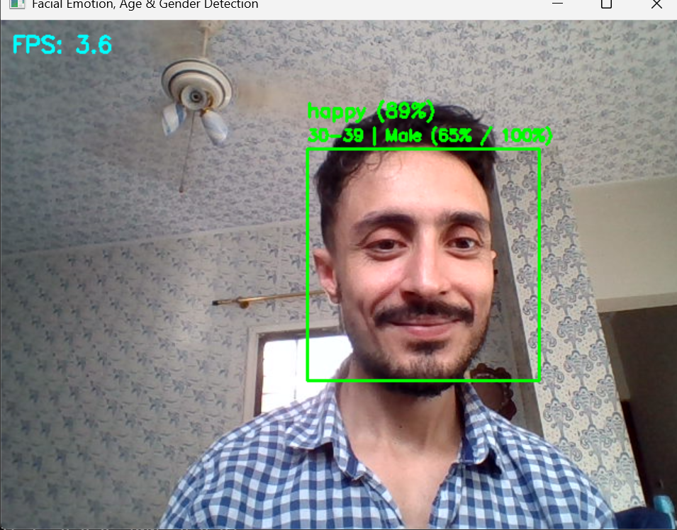
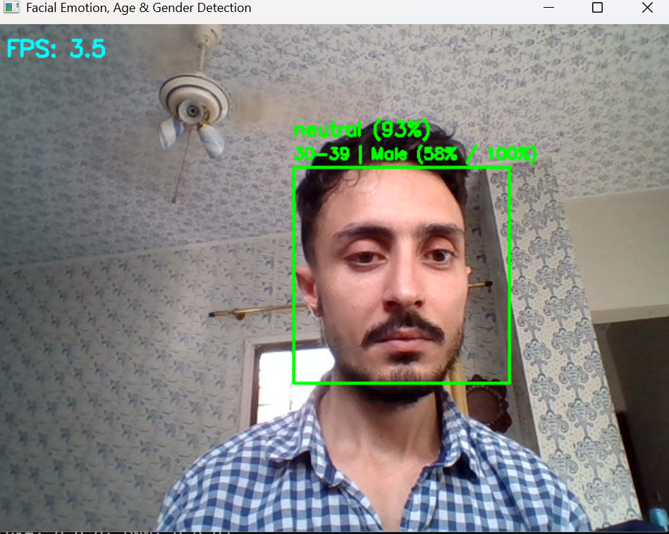
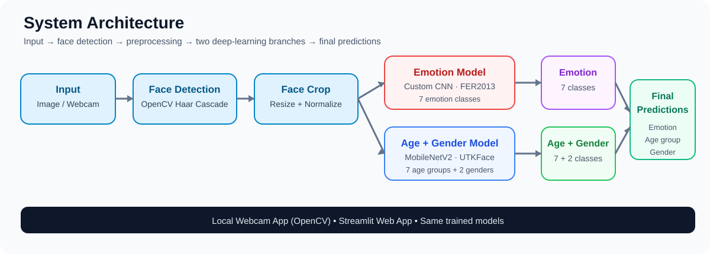

# Facial Emotion, Age Group & Gender Prediction

> **A real-time multi-task facial analysis application built with Deep Learning, Computer Vision and Streamlit.**

<p align="center">
  <a href="https://github.com/Amiri313/FER-Age-Gender-Emotion-Project"></a>
  
  
  
  
</p>

<p align="center">
  
  
</p>

## 🚀 Project Overview

This project detects faces from an image or webcam feed and predicts three attributes for each detected face:

- **Emotion:** 7 classes using a custom CNN trained on **FER2013**
- **Age group:** 7 classes using **MobileNetV2 transfer learning** trained on **UTKFace**
- **Gender:** 2 classes using the same MobileNetV2 multi-output model
- **Face detection:** OpenCV Haar Cascade
- **Interfaces:** local OpenCV webcam application + interactive Streamlit web app

The goal was not only to train models, but to take them through a complete applied ML workflow: data preparation, augmentation, class weighting, transfer learning, fine-tuning, evaluation, model export, inference and deployment-ready application development.

> ⚠️ **Important:** The outputs are probabilistic model predictions and can be wrong. They should not be treated as reliable judgments of identity, personality, or actual demographic characteristics.

## 🧠 System Architecture



**Pipeline:**

`Image / Webcam → Face Detection → Face Crop & Preprocessing → Emotion CNN + MobileNetV2 → Emotion / Age Group / Gender Predictions`

Two models are used because the tasks have different inputs and learning requirements:

1. **Emotion model:** a custom CNN trained on 48×48 grayscale FER2013 images.
2. **Age + gender model:** MobileNetV2 with ImageNet transfer learning, adapted for two outputs and fine-tuned on UTKFace.

## 🎬 Demo

### Local webcam application

The local application performs real-time face detection and prediction using OpenCV.

```bash
python src/webcam_app.py
```

For a single image:

```bash
python src/webcam_app.py --image path/to/photo.jpg
```

### Streamlit web application

The Streamlit version provides camera snapshots and image upload, with a clearer results dashboard and per-face prediction details.

```bash
streamlit run streamlit_app/streamlit_app.py
```

> **Live Streamlit demo:** deployment is configured in `DEPLOYMENT.md`. Once the app is published on Streamlit Community Cloud, add the public URL here.

## 📊 Model Performance

| Task | Dataset | Validation accuracy |
|---|---|---:|
| Emotion recognition | FER2013 | **59.4%** |
| Age-group classification | UTKFace | **58.1%** |
| Gender classification | UTKFace | **87.2%** |

### Emotion classification


The emotion model performs best on classes such as **Happy** and **Surprise**, while **Fear** and **Disgust** remain challenging. This is reflected in the per-class precision, recall and F1 results in the full project report.

### Age & gender

Age prediction is substantially harder than gender prediction because adjacent age groups have visually overlapping features and the target labels are coarse age brackets.

For the complete evaluation, including classification reports, training curves, fine-tuning comparison and limitations, see **[PROJECT_REPORT.md](PROJECT_REPORT.md)**.

## ✨ Key Features

- 🎭 7-class facial emotion recognition
- 🎂 7-class age-group prediction
- 👤 Binary gender classification
- 👁️ Face detection with OpenCV Haar Cascade
- 🧠 Custom CNN for emotion recognition
- 🔄 MobileNetV2 transfer learning + fine-tuning
- 📈 Confusion matrices and detailed evaluation
- 🎥 Real-time local webcam inference
- 🌐 Streamlit web interface
- 👥 Multiple-face detection in a single image
- ⚠️ Explicit uncertainty and limitation disclosure

## 🛠️ Technology Stack

**Python · TensorFlow/Keras · OpenCV · NumPy · Streamlit · Matplotlib · Pillow · MobileNetV2 · CNN · Transfer Learning**

## 📁 Project Structure

```text
FER-Age-Gender-Emotion-Project/
├── README.md
├── PROJECT_REPORT.md
├── DEPLOYMENT.md
├── LICENSE
├── requirements.txt
├── .gitignore
├── haarcascade_frontalface_default.xml
│
├── assets/
│   ├── architecture.svg
│   ├── app_demo/
│   │   ├── demo_angry.png
│   │   ├── demo_happy.png
│   │   ├── demo_neutral.png
│   │   └── demo_sad.png
│   ├── emotion_confusion_matrix.png
│   ├── emotion_training_curves.png
│   ├── fer2013_class_distribution.png
│   ├── utkface_age_gender_distribution.png
│   ├── age_gender_initial_curves.png
│   ├── age_gender_finetune_curves.png
│   ├── before_after_finetuning.png
│   └── example_predictions.png
│
├── models/
│   ├── README.md
│   ├── emotion_model.keras
│   └── age_gender_model_finetuned.keras
│
├── notebooks/
│   └── Facial_Emotion_Age_Gender_Prediction.ipynb
│
├── src/
│   └── webcam_app.py
│
└── streamlit_app/
    ├── streamlit_app.py
    └── requirements.txt
```

## ⚙️ Run Locally

### 1. Clone the repository

```bash
git clone https://github.com/Amiri313/FER-Age-Gender-Emotion-Project.git
cd FER-Age-Gender-Emotion-Project
```

### 2. Create an environment

```bash
python -m venv .venv
```

Windows:

```bash
.venv\Scripts\activate
```

macOS/Linux:

```bash
source .venv/bin/activate
```

### 3. Install dependencies

```bash
pip install -r requirements.txt
```

### 4. Run the webcam application

```bash
python src/webcam_app.py
```

### 5. Run the Streamlit application

```bash
streamlit run streamlit_app/streamlit_app.py
```

## 📓 Notebook

`notebooks/Facial_Emotion_Age_Gender_Prediction.ipynb` contains the main training workflow, including dataset preparation, augmentation, model training, evaluation, fine-tuning and model export. It was designed for Google Colab and uses the Kaggle API for dataset access.

## 🔬 What I Learned

This project helped me move from simply training models to building an end-to-end computer vision application. The main areas covered were:

- CNN architecture design
- Image preprocessing and augmentation
- Class imbalance and class weighting
- Transfer learning with MobileNetV2
- Multi-output neural networks
- Fine-tuning pretrained models
- Model evaluation and confusion-matrix analysis
- Real-time computer vision inference
- Building a Streamlit interface
- Communicating model limitations responsibly

## 🔮 Future Improvements

- Improve weak emotion classes, especially Fear and Disgust
- Compare MobileNetV2 with EfficientNetV2-B0
- Add temporal smoothing for more stable webcam predictions
- Calibrate confidence scores and add reliability diagrams
- Investigate better age-label strategies and adjacent age-group confusion

## 👥 Project Team

**Jahangir Amiri & Sadaf Aslam**  
Deep Learning Course · PGD in Data Science & AI  
NED University of Engineering & Technology  
Instructor: **Sir Sajid Majeed**

## 📄 Full Documentation

- **[Project Report](PROJECT_REPORT.md)** — methodology, experiments, metrics and limitations
- **[Deployment Guide](DEPLOYMENT.md)** — local and Streamlit deployment instructions
