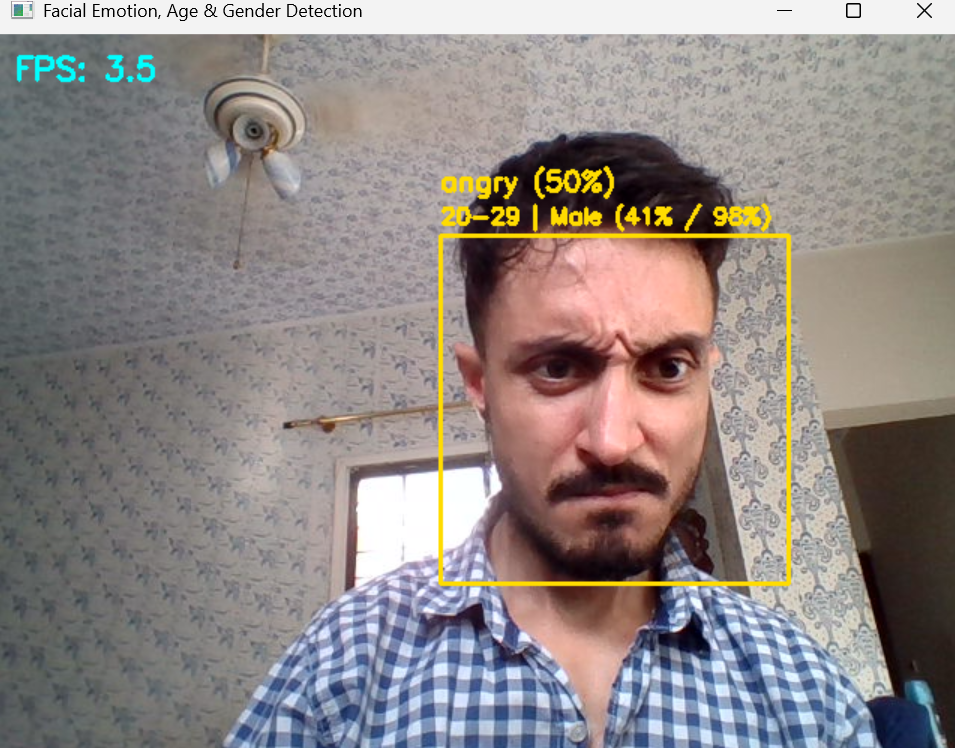
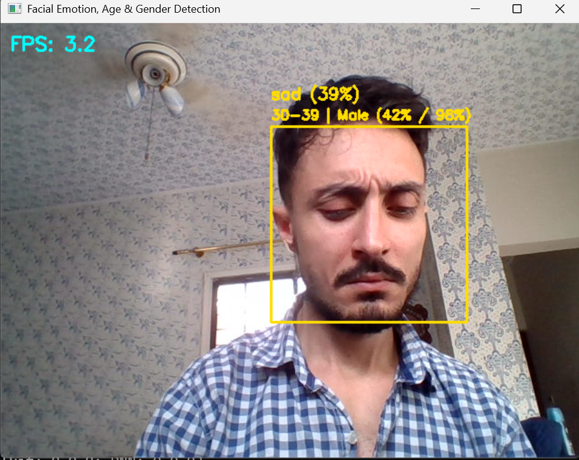

# Facial Emotion, Age Group, and Gender Prediction

Real-time facial analysis from a webcam or photo — detects a face and predicts emotion, age group, and gender.

- **Emotion** (7-class) — custom CNN, FER2013
- **Age group** (7-class) + **gender** — MobileNetV2 transfer learning on UTKFace, fine-tuned
- **Face detection** — OpenCV Haar Cascade

| | |
|---|---|
| **Partners** | Jahangir Amiri & Sadaf Aslam |
| **Course** | Deep Learning |
| **Instructor** | Sir Sajid Majeed |
| **Program** | Post Graduate Diploma (PGD) in Data Science & AI, NED University of Engineering & Technology |

> Predictions are probabilistic model outputs. Not a reliable indicator of identity, personality, or actual demographic characteristics.

## Demo

<p align="center">
  
  
  <br/>
  
  
</p>

## Results

| Task | Validation accuracy |
|---|---|
| Emotion | 59.4% |
| Age group | 58.1% |
| Gender | 87.2% |


Full breakdown: [PROJECT_REPORT.md](PROJECT_REPORT.md)

## Structure

```text
FER-Age-Gender-Emotion-Project/
├── README.md
├── PROJECT_REPORT.md
├── DEPLOYMENT.md
├── LICENSE
├── requirements.txt
├── .gitignore
├── haarcascade_frontalface_default.xml
├── assets/
│   ├── app_demo/
│   │   ├── demo_angry.png
│   │   ├── demo_happy.png
│   │   ├── demo_neutral.png
│   │   └── demo_sad.png
│   ├── emotion_confusion_matrix.png
│   ├── emotion_training_curves.png
│   ├── fer2013_class_distribution.png
│   ├── utkface_age_gender_distribution.png
│   ├── age_gender_initial_curves.png
│   ├── age_gender_finetune_curves.png
│   ├── before_after_finetuning.png
│   └── example_predictions.png
├── models/
│   ├── README.md
│   ├── emotion_model.keras
│   └── age_gender_model_finetuned.keras
├── notebooks/
│   └── Facial_Emotion_Age_Gender_Prediction.ipynb
├── src/
│   └── webcam_app.py
└── streamlit_app/
    ├── streamlit_app.py
    └── requirements.txt
```

## Setup

```bash
python -m venv .venv
source .venv/bin/activate      # Windows: .venv\Scripts\activate
pip install -r requirements.txt
```

## Usage

```bash
python src/webcam_app.py
python src/webcam_app.py --camera 1
python src/webcam_app.py --image photo.jpg
```

## Web demo

```bash
streamlit run streamlit_app/streamlit_app.py
```

Deployment: [DEPLOYMENT.md](DEPLOYMENT.md)

## Notebook

`notebooks/Facial_Emotion_Age_Gender_Prediction.ipynb` — dataset prep, training, evaluation, fine-tuning, export. Built for Colab, downloads datasets via Kaggle API.
